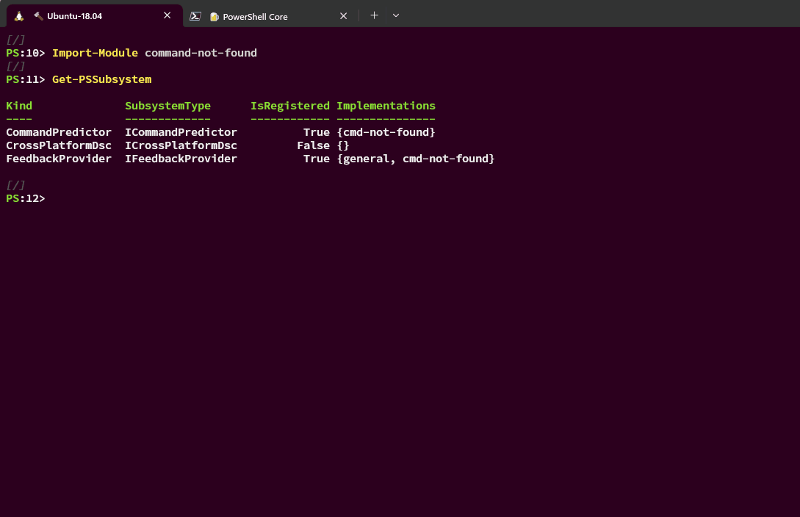

# command-not-found

The `command-not-found` module is a feedback provider plugin for PowerShell.
This feedback provider depends on the `command-not-found` utility,
which is often available on Linux by default,
to provide suggestions when a native command cannot be found.

`bash` also calls the `command-not-found` utility to provide suggestions when a command cannot be found.
But this feedback provider plugin does more than that,
thanks to the [command-line predictor][command-line-predictor] feature in PowerShell.
It also implements the `ICommandPredictor` interface and serves as a predictor.
When the resulted feedback contains actionable items, such as commands to run,
they will be used as predictive suggestions to streamline the user's command-line experience.

 

## Requirements

The `command-not-found` plugin is built on the `IFeedbackProvider` interface,
which is available with PowerShell `7.4.0-preview.2` or above.
To display prediction suggestions from the `command-not-found`,
you need [PSReadLine 2.2.6][psreadline-226] or above.

- PowerShell `7.4.0-preview.2` or above
- PSReadLine `2.2.6` or above

## Documentation

PowerShell feedback providers and predictors are written in C# and registered with the PowerShell [Subsystem Plugin Model][subsystem-plugin-model].
To learn more, see "How to create a feedback provider" and ["How to create a command-line predictor"][how-to-create-predictor].

## Build

Make sure the [latest .NET 8 SDK](https://dotnet.microsoft.com/download/dotnet/8.0) is installed
and available in your `PATH` environment variable.
Run `.\build.ps1` from `pwsh` to build the project.
The module will be published to `.\bin\command-not-found` by a successful build.

## Code of Conduct

Please see our [Code of Conduct](.github/CODE_OF_CONDUCT.md) before participating in this project.

## Security Policy

For any security issues, please see our [Security Policy](.github/SECURITY.md).

[command-line-predictor]: https://learn.microsoft.com/en-us/powershell/scripting/learn/shell/using-predictors?view=powershell-7.3
[psreadline-226]: https://www.powershellgallery.com/packages/PSReadLine/2.2.6
[subsystem-plugin-model]: https://docs.microsoft.com/powershell/scripting/learn/experimental-features#pssubsystempluginmodel
[how-to-create-predictor]: https://docs.microsoft.com/powershell/scripting/dev-cross-plat/create-cmdline-predictor
